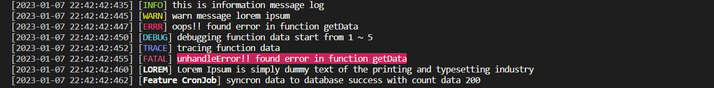

<h1 align="center">
    LOGGING-PRETTY
</h1>

<p align="center">
  
  
  <a href="#">
    
  </a>
  
  
  
  <a href="#">
    
  </a>
</p>

<br>



<br>

### 💻 Step to install :

```
npm i logging-pretty
```

### ✏️ Example :

```typescript
import { LoggingPretty } from "logging-pretty"

/**
 *
 * @param force [optional] force mode, if "pathFile" is set but this is set to "console" it will not write to the log file.
 * @param pathFile [optional] set path file for store log.
 * @param formatTime [optional] set format date time like YYYY-MM-DD HH:mm:ss.
 * @returns object
 */
const log = new LoggingPretty({
  force: `all`,
  pathFile: `./test/store.log`,
  formatTime: `YYYY-MM-DD HH:mm:ss`
})

log._renderLogToConsole = ({ strTime, strTag, strStyleTag, strStyleMsg }) => {
  // override render log
  if (strTag == `INFO`) console.log(`[${strTime}] ${strStyleTag}: -> -> ${strStyleMsg}`)
  if (strTag == `FAIL`) console.log(`[${strTime}] ${strStyleTag}: x x ${strStyleMsg}`)
}

log.info(`info task`) // [2024-07-14 17:46:32] INFO: -> -> info task
log.fail(`fail task`) // [2024-07-14 17:46:32] FAIL: x x fail task
```

### 🧾 Pre-Requisistes :

```
- node.js / bun.js / deno.js
- (optional) typescript
- (optional) commonJS
- (optional) ESM
```

### 📝 License :

Licensed see [here](./LICENSE)
